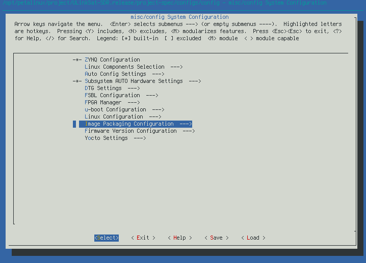
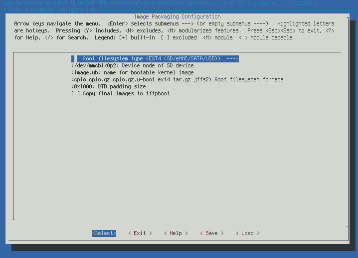
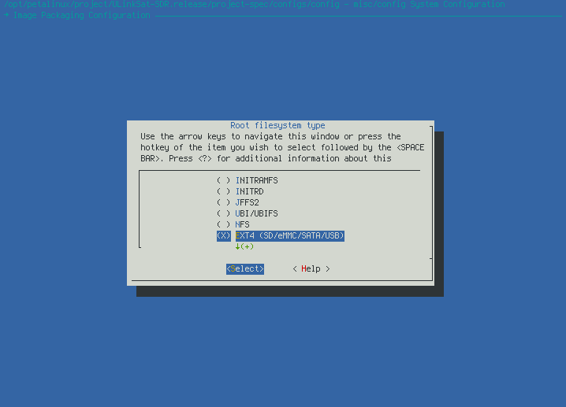

# 使用 Docker 製作 PetaLinux 2022.1 的 OS image

## 安裝 docker

### Ubuntu

```Shell
apt install docker.io docker-buildx
```

### ArchLinux

```Shell
pacman -S docker docker-buildx
```

## 建立 docker image

### Ubuntu 20.04

[Dockerfile.ubuntu20.04](https://drive.google.com/file/d/19tjlgCNvXRbWFOOb1KQi-rv-QpohIt2d/view?usp=drive_link)

```Shell
$ docker build --no-cache -t petalinux.build:20.04 -f Dockerfile.ubuntu20.04 .
```

檢視 docker image 建立結果

```Shell
$ docker images
REPOSITORY        TAG       IMAGE ID       CREATED          SIZE
petalinux.build   20.04     0ff139a32236   24 seconds ago   1.05GB
```

### Ubuntu 18.04

[Dockerfile.ubuntu18.04](https://drive.google.com/file/d/1qWDwN4JP4nXVEr4raIf2Gx30GY7sTqQw/view?usp=drive_link)

```Shell
$ docker build --no-cache -t petalinux.build:18.04 -f Dockerfile.ubuntu18.04 .
```

檢視 docker image 建立結果

```Shell
$ docker images                                                     
REPOSITORY        TAG       IMAGE ID       CREATED          SIZE
petalinux.build   18.04     c0fec72ff948   10 seconds ago   854MB
```

## 建立及啓動 docker container

### 建立和檢視 docker container

```Shell
docker create -it <image>
```

> option -it 要指定，才能正確進入 container
>
> ```
> -i, --interactive                      Keep STDIN open even if not attached
>```
>```
> -t, --tty                              Allocate a pseudo-TTY
> ```

檢視 docker image 建立結果

```Shell
docker ps -a
docker container ls -a
```

例如建立一個依附於 image `0ff139a32236` 的 container

```Shell
$ docker create 0ff139a32236
3b36f11cd26e6b38d7585ab12db0aa119eca25117bb0b1a39fefba8ddefaa624
$ docker ps -a
CONTAINER ID   IMAGE          COMMAND       CREATED          STATUS                      PORTS     NAMES
3b36f11cd26e   0ff139a32236   "/bin/bash"   30 seconds ago   Created                               inspiring_dijkstra
```

### 啓動 container

```Shell
docker container start <container_id>
```

例如啓動 container `3b36f11cd26e`

```Shell
$ docker container start 3b36f11cd26e
3b36f11cd26e
$ docker ps -a
CONTAINER ID   IMAGE          COMMAND       CREATED          STATUS                      PORTS     NAMES
3b36f11cd26e   0ff139a32236   "/bin/bash"   9 minutes ago    Exited (0) 8 seconds ago              inspiring_dijkstra
```

### 進入 container

```Shell
docker container attach <container_id>
```

例如進入 container `3b36f11cd26e`

```Shell
$ docker attach 3b36f11cd26e
petalinux@3b36f11cd26e:~$ 
```

## 安裝 PetaLinux 2022.1

完整安裝步驟請見 PetaLinux Tools Documentation: Reference Guide (UG1144) 的 [Installation Steps](https://docs.amd.com/r/2022.1-English/ug1144-petalinux-tools-reference-guide/Installation-Steps)

### 下載 PetaLinux 2022.1 installer

進入 https://www.xilinx.com/member/forms/download/xef.html?filename=petalinux-v2022.1-04191534-installer.run 下載

> 須要註冊帳號

下載後依照 PetaLinux Tools Documentation: Reference Guide (UG1144) 的 [Installing the PetaLinux Tool](https://docs.amd.com/r/2022.1-English/ug1144-petalinux-tools-reference-guide/Installing-the-PetaLinux-Tool) 的說明進行安裝

在 docker container 中安裝 PetaLinux 可有幾種選擇

- 直接安裝在 docker container 中
  - 優點: 簡單
  - 缺點: 
    - 若有超過一個 docker container 會用到 PetaLinux，例如 Ubuntu 20.04 和 18.04，則會有多份 PetaLinux
    - 若不小心移除未更新到 image 的 container，則所有 container 中的資料都會消失
- 安裝在 host，再連接進 docker container
  - 優點: docker container 可共用 PetaLinux
  - 缺點: 
    - 建立 docker container 時須指定 volume 連接
    - host 及 container 共用 volume 的 user 及 group ID 要相同

直接安裝在 docker container 的方式依照 reference guide 的說明安裝即可

以下爲安裝 PetaLinux 在 host 的說明

- PetaLinux 2022.1 installer: `petalinux-v2022.1-04191534-installer.run`
- 共用 volume: `/opt`
- PetaLinux 安裝目錄: `/opt/petalinux/2022.1`

### Create docker container

以 host 及 docker container 共用 /opt 目錄爲例

image 和 container ID 請以實際的 ID 爲主

```Shell
$ docker create -it --privileged -v /opt:/opt <image>
```

- `--privileged`: 給 container 更多的權限來讀寫 device 等
- `-v`: 就是 `--volume`，連接 host 及 contaiuner 的 volume
  - `-v /opt:/opt`: 把 host 的 /opt 目錄連接到 container 的 /opt 目錄

### Start and attach container

```Shell
$ docker start <container_id>
$ docker attach <container_id>
```

### 安裝 PetaLiinux

#### In host

- Create directory /opt/petalinux and change owner
  ```Shell
  sudo mkdir /opt/petalinux
  sudo chown 1000:1000 /opt/petalinux
  ```
- 把下載的 PetaLinux installer `petalinux-v2022.1-04191534-installer.run`複製到 `/opt/petalinux`
    必要時要變更 owner

#### In container

- 執行 `/opt/petalinux/petalinux-v2022.1-04191534-installer.run` 安裝 PetaLinux 到 `/opt/petalinux/2022.1`
  ```Shell
  $ /opt/petalinux/petalinux-v2022.1-04191534-installer.run -d /opt/petalinux/2022.1
  ```

## Build PetaLinux OS image

建立 PetaLinux project 的詳細步驟請見 PetaLinux Tools Documentation: Reference Guide (UG1144) 的 [Creating a Project](https://docs.amd.com/r/2022.1-English/ug1144-petalinux-tools-reference-guide/Creating-a-Project) 的說明

- 進入 container
- 建立工作目錄並進入工作目錄
  -  例如 /opt/petalinux/project
     ```Shell
     $ mkdir -p /opt/petalinux/project
     $ cd /opt/petalinux/project
     ```
- 進入 PetaLinux environment
     ```Shell
     $ source /opt/petalinux/2022.1/settings.sh
     ```
- 建立 ULinkSat SDR 專案
  -  從 Google driver 下載 PetaLinux BSP file  [ULinkSat-SDR.release.bsp](https://drive.google.com/file/d/1G5KvSNHeh9afg2nyq2xjCmeNE-C3sm1R/view?usp=drive_link)

     ```Shell
     $ petalinux-create -t project -s ULinkSat-SDR.release.bsp
     ```
- Setup system configuration
  -  例如變更 rootfs
    
     
    
    詳細 petalinux-config 操作見 PetaLinux Tools Documentation: Reference Guide (UG1144) 的 [Customizing the Project](https://docs.amd.com/r/2022.1-English/ug1144-petalinux-tools-reference-guide/Customizing-the-Project)

    <br>

  -  若無需變更，可執行以下指令建立 build directory

     ```Shell
     $ petalinux-config --silent
     ```
- 調整其他設置
  -  例如指定 PetaLinux download cache 來減少 build image 的時間，以下說明用 symbolic link 方式連接 download cache 路徑 `/opt/petalinux/cache/2022.1/downloads`

     ```Shell
     $ cd build
     $ ln -snf /opt/petalinux/cache/2022.1/downloads .
     $ cd -
     ```
- Build project
     ```Shell
     $ petalinux-build
     ```
- 建立 image packages
     ```Shell
     $ petalinux-package --force --prebuilt && petalinux-package --force --boot --fsbl images/linux/zynq_fsbl.elf --fpga images/linux/system_top.bit --u-boot images/linux/u-boot.elf
     ```

    成功後，image packages 在 `images/linux` 目錄

## 燒錄 OS image

[ULinkSat-SDR.release.bsp](https://drive.google.com/file/d/1G5KvSNHeh9afg2nyq2xjCmeNE-C3sm1R/view?usp=drive_link) 的 rootfs 爲 Ext4，可以需求執行 `petalinux-config` 調整

- Ext4

  - 利用 tar.gz 包

    -   參考 PetaLinux Tools Documentation: Reference Guide (UG1144) 的 [Booting PetaLinux Image on Hardware with an SD Card](https://docs.amd.com/r/2022.1-English/ug1144-petalinux-tools-reference-guide/Booting-PetaLinux-Image-on-Hardware-with-an-SD-Card) 說明製作 bootable SD card

    -   或參考 [prog_ext4_sd.sh](https://drive.google.com/file/d/1yWu4EHlhasOl4lUP-ryZS7h1YrAPtkvt/view?usp=drive_link) 進行燒錄

  - 利用 WIC image

    -   製作 WIC image 的方式見 PetaLinux Tools Documentation: Reference Guide (UG1144) [petalinux-package --wic Command Examples](https://docs.amd.com/r/2022.1-English/ug1144-petalinux-tools-reference-guide/petalinux-package-wic-Command-Examples)

    -   `petalinux-package --wic` 製作出的 image 有 6GB，要減少燒錄時間可參考 [prog_wic.sh](https://drive.google.com/file/d/1ayfRlSvscsBjNAyenX1XbXIh7-pYShpP/view?usp=drive_link) 利用 bmap file 的方式行之

        > 注意: 
        >
        > 實作發現用 bmap file 會出現開機失敗情形，對策是重新複製 BOOT.BIN 帶 boot partition 及可，[prog_wic.sh](https://drive.google.com/file/d/1ayfRlSvscsBjNAyenX1XbXIh7-pYShpP/view?usp=drive_link) 有進行這個修正

- JFFS2

  - Setup JFFS2 boot
    -   設置 JFFS2 rootfs 的方式可參考 PetaLinux Tools Documentation: Reference Guide (UG1144) [Configuring JFFS2 Boot](https://docs.amd.com/r/2022.1-English/ug1144-petalinux-tools-reference-guide/Configuring-JFFS2-Boot)，但要注意坑不少

    -   若僅切換 ULinkSat SDR 爲 JFFS2 boot，可參考以下 shell script

        ```Shell
        #!/bin/bash
        
        msg_info()
        {
            echo -e "\e[0;32m${1}\e[0m"
        }
        
        msg_error()
        {
            echo -e "[ERROR] \e[0;31m${1}\e[0m"
        }
        
        error_exit() {
            msg_error "${1}"
            false
            exit 1
        }
        
        disable_all_rootfs() {
            msg_info "---->>> Disable all rootfs types"
            for f in ${FS_LST}; do
                f="CONFIG_SUBSYSTEM_ROOTFS_${f}"
                [[ ${TEST} -eq 0 ]] || echo "${f}"
                sed ${SED_OPTS} "s/.*${f}.*/# ${f} is not set/g" ${SYSCONF}
            done
        }
        
        disable_all_jffs2_erase_size() {
            local size_lst="4 8 16 32 64 128 256 512"
            msg_info "---->>> Disable all JFFS2 erase sizes"
            for s in ${size_lst}; do
                s="CONFIG_SUBSYSTEM_JFFS2_ERASE_SIZE_${s}"
                [[ ${TEST} -eq 0 ]] || echo "${s}"
                if [[ $(grep ${s} <<< ${SYSCONF}) ]]; then
                    sed ${SED_OPTS} "s/.*${s}.*/# ${s} is not set/g" ${SYSCONF}
                else
                    echo "# ${s} is not set" >>  ${SYSCONF}
                fi
            done
              
            unset size_lst
        }
        
        chg_rootfs() {
            [[ -z ${FS_TYPE} ]] && error_exit "Rootfs type not assign."
        
            FS_TYPE=$(echo ${FS_TYPE} | tr '[:lower:]' '[:upper:]')
            msg_info "---->>> Set rootfs to ${FS_TYPE}"
        
            FS_LST="INITRAMFS INITRD JFFS2 UBIFS EXT4 OTHER"
            FS_FOUND=0
            for f in ${FS_LST}; do
                [[ ${f} != ${FS_TYPE} ]] && continue
                FS_FOUND=1
                break
            done
        
            [[ ${FS_FOUND} -eq 0 ]] && error_exit "Rootfs ${FS_TYPE} not supported"
        
            # Disable all rootfs types
            disable_all_rootfs
            msg_info "---->>> Enable rootfs ${FS_TYPE}"
            ERASE_SIZE="4"
            f="CONFIG_SUBSYSTEM_ROOTFS_${FS_TYPE}"
            sed ${SED_OPTS} "s/.*${f}.*/${f}=y/g" ${SYSCONF} && sync || error_exit "Failed to change rootfs type"
            case ${FS_TYPE} in
                'JFFS2')
                    disable_all_jffs2_erase_size
                    msg_info "---->>> Set JFFS2 erase size to ${ERASE_SIZE}K"
                    sed ${SED_OPTS} "s/.*CONFIG_SUBSYSTEM_JFFS2_ERASE_SIZE_${ERASE_SIZE}.*/CONFIG_SUBSYSTEM_JFFS2_ERASE_SIZE_${ERASE_SIZE}=y/g" ${SYSCONF} && sync || error_exit "Failed to change JFFS erase size" 
                    ;;
            esac
          
            msg_info "---->>> Update system config"
            petalinux-config --silent || error_exit "Failed to update system config"
        }
          
        print_usage() {
            echo "Usage: $(basename $0) [-r <rootfs>] [-t]"
            exit 0
        }
          
        cmdpath=$(dirname $(readlink -f $0))
          
        while getopts "r:m:qth" arg
        do
            case $arg in
                r)
                    FS_TYPE=$(tr '[:upper:]' '[:lower:]' <<< ${OPTARG})
                    ;;
                t)
                    TEST=1
                    ;;
                ?|h)
                    print_usage
                    ;;
            esac
        done
        shift $((OPTIND - 1))
        PROJDIR="$@"
          
        [[ -z ${PROJDIR} ]] && PROJDIR="."
        [[ -d ${PROJDIR} ]] || error_exit "Directory ${PROJDIR} not found"
          
        TEST=0
        SED_OPTS="-e"
        [[ ${TEST} -eq 0 ]] && SED_OPTS="-i ${SED_OPTS}"
          
        SYSCONF="${PROJDIR}/project-spec/configs/config"
          
        [[ -z ${FS_TYPE} ]] || chg_rootfs
    
  - 燒錄 JFFS2 
    -   不建議用 PetaLinux Tools Documentation: Reference Guide (UG1144) 的方式燒錄，用 Vitis 比較穩妥
  
    -   Vitis 不用安裝在 docker container，可安裝在其他平臺

    - 安裝 Vitis
      -    燒錄 flash 需要 Xilinx 的 xsct，PetaLinux 沒有，須安裝 Vitis
  
      - 從 https://www.xilinx.com/support/download/index.html/content/xilinx/en/downloadNav/vitis.html 下載 Vitis installer
      - 安裝方式請自行參考 Vitis Release Notes And Installation Guide (UG1742) 的 [Vitis Software Platform Installation](https://docs.amd.com/r/en-US/ug1742-vitis-release-notes/Vitis-Software-Platform-Installation)
    - 燒錄
      - SDR 切換到 JTAG mode
      - 使用 Vitis GUI
        - ​    請直接參考 Vitis document
      - Vitis CLI program_flash
        - ​    參考 [prog_jffs2.sh](https://drive.google.com/file/d/1FJiqBr8NpmHZrcXhIG4xonrOiiDbeT3E/view?usp=drive_link)